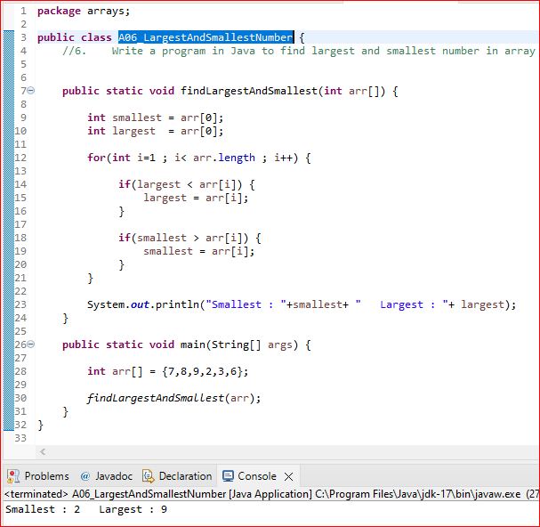

# <u>Java_Array_programs_master</u>

  ### 1.	Write a program in Java for, In array 1-100 numbers are stored, one number is missing how do you find it.
     
   ***First way : Using ExtraIteration***  
    
   
   
   ***Second way : Using Formula***  
    
   

### 2.	Write a program in Java for, In a array 1-100 multiple numbers are duplicates, how do you find it.
     
     
   

### 3.	Write a program in Java for, How to find all pairs in array of integers whose sum is equal to given number.
         
   

### 4.	Write a program in Java for, In a array 1-100 exactly one number is duplicate how do you find it.
     
    

### 5.	Write a program in Java for, Given two arrays {1,2,3,4,5,6,7} and {1,2,3,4,6,7} find which number is not present in the second array.
    
   
   
### 6.	Write a program in Java to find largest and smallest number in array.
    
   

### 7.	Write a program in Java to find second highest number in an integer array.
    
   

### 8.	Write a program to find the top two Largest  Numbers and Top two Smallest Numbers number in the array
    
   
   
    

### 9.	Java program to print array in reverse Order.
    
    

   

 
